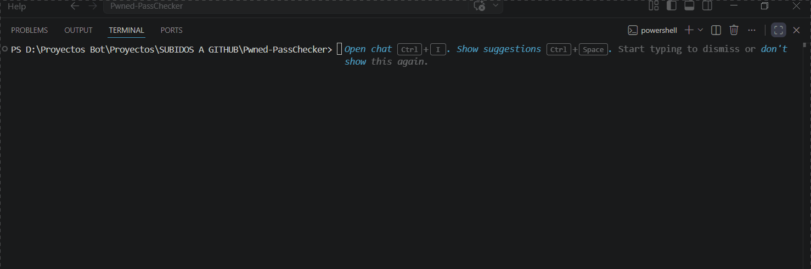

# 🔐 Pwned PassChecker v2.0

[](https://www.python.org/)
[](LICENSE)
[](https://haveibeenpwned.com/API/v3)


## 🎬 Demo



Verificador de contraseñas filtradas con **Have I Been Pwned (HIBP)** usando **k-Anonymity** — nunca se envía la contraseña completa a la API. Incluye generador criptográficamente seguro.

---

## ✨ Características

| Feature | Descripción |
|---|---|
| 🔒 k-Anonymity | Solo se envían los primeros 5 chars del hash SHA-1 |
| 🔄 Retry automático | Reintentos con backoff ante errores de red o rate-limit |
| 📂 Verificación masiva | Procesa listas de contraseñas desde archivo |
| 📄 Reportes | Exporta resultados en JSON o CSV |
| 🎲 Generador seguro | Usa `secrets` (criptográficamente seguro) |
| 🐳 Docker ready | Imagen lista para contenedores |
| ✅ Tests incluidos | Suite con pytest + mocks |

---

## 📋 Requisitos

- Python **3.10+**
- pip

---

## 🚀 Instalación

```bash
git clone https://github.com/technssoluciones-dev/Pwned-PassChecker.git
cd Pwned-PassChecker


# O manualmente:
pip install -r requirements.txt
pip install -e .
```

---

## 📖 Uso

### Verificar contraseña (modo interactivo)

```bash
pwned-checker check -i
# → Solicita contraseña sin mostrarla en pantalla
```

### Verificar lista de contraseñas

```bash
pwned-checker check -f sample_passwords.txt
pwned-checker check -f mis_claves.txt -o reports/resultado.json
pwned-checker check -f mis_claves.txt -o reports/resultado.csv
```

### Generar contraseñas seguras

```bash
# Una contraseña de 14 caracteres (default)
pwned-checker generate

# 5 contraseñas de 20 caracteres
pwned-checker generate -n 5 -l 20

# Sin símbolos, sin ambigüedades (0,O,l,1…)
pwned-checker generate -n 3 --no-symbols --no-ambiguous
```

## ⚠️ Nota para Windows

Si tras instalar el comando `pwned-checker` no se reconoce, es porque la carpeta
`Scripts` de Python no está en tu PATH (advertencia común de pip). Dos soluciones:

1. Usa el comando alternativo sin depender del PATH:
   ```bash
   python -m pwned_checker check -i
   ```
2. O agrega la carpeta Scripts a tu PATH (la ruta aparece en el mensaje de advertencia
   de `pip install`), cierra y reabre la terminal.

### Scripts heredados (compatibilidad)

```bash
python pwned_checker.py -i
python pwned_checker.py -f sample_passwords.txt -o reporte.json
python password_generator.py -l 18 -n 3
```

---

## 🐳 Docker

```bash
# Construir imagen
docker build -t pwned-checker .

# Verificar interactivamente
docker run --rm -it pwned-checker check -i

# Verificar archivo y guardar reporte en ./reports/
docker run --rm -it \
  -v $(pwd)/reports:/home/appuser/app/reports \
  -v $(pwd)/sample_passwords.txt:/home/appuser/app/sample_passwords.txt:ro \
  pwned-checker check -f sample_passwords.txt -o reports/result.json
```

---

## 🧪 Testing

```bash
# Tests básicos
pytest tests/ -v

# Con cobertura
pytest tests/ --cov=src/pwned_checker --cov-report=term-missing

# Con Make
make test
make test-cov
```

---

## ⚙️ Configuración

Copia `.env.example` a `.env` y ajusta según necesites:

```bash
cp .env.example .env
```

Variables disponibles:

| Variable | Default | Descripción |
|---|---|---|
| `HIBP_TIMEOUT` | `10` | Timeout HTTP en segundos |
| `HIBP_RETRIES` | `3` | Reintentos ante error |
| `LOG_LEVEL` | `WARNING` | Nivel de log (`DEBUG`/`INFO`/`WARNING`) |
| `LOG_FILE` | `` | Archivo de log (vacío = solo consola) |
| `DEFAULT_PWD_LENGTH` | `14` | Longitud default del generador |
| `REPORTS_DIR` | `reports` | Directorio para reportes |

---

## 🏗️ Arquitectura

```
src/pwned_checker/
├── __init__.py     ← versión y metadatos
├── config.py       ← configuración centralizada (.env)
├── logger.py       ← logging estructurado
├── checker.py      ← lógica HIBP con retry y k-Anonymity
├── generator.py    ← generador criptográfico
└── cli.py          ← interfaz CLI unificada (entry point)
```

---

## 🔒 Privacidad y Seguridad

- La contraseña **nunca** sale de tu máquina completa
- Solo se envían los **primeros 5 caracteres** del hash SHA-1
- Los reportes enmascaran passwords por defecto (`mi***...`)
- Usa `--expose-passwords` solo en entornos privados y seguros
- El generador usa `secrets` del módulo estándar (CSPRNG)

---

## 📄 Licencia

MIT © 2026 [technssoluciones-dev](https://github.com/technssoluciones-dev)

